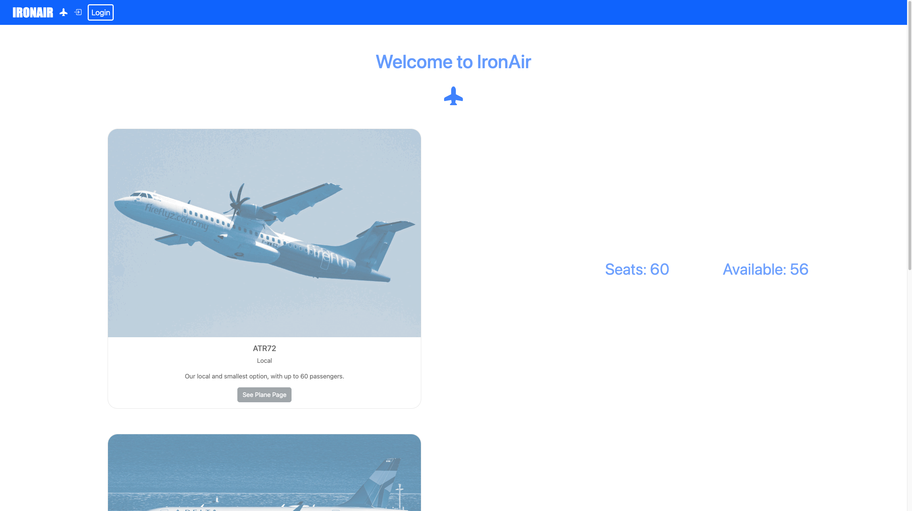
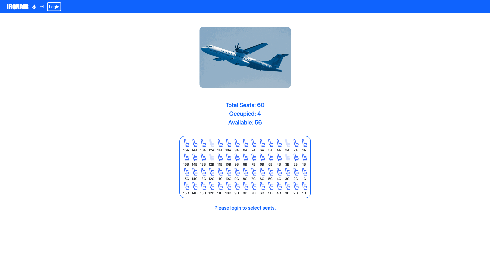
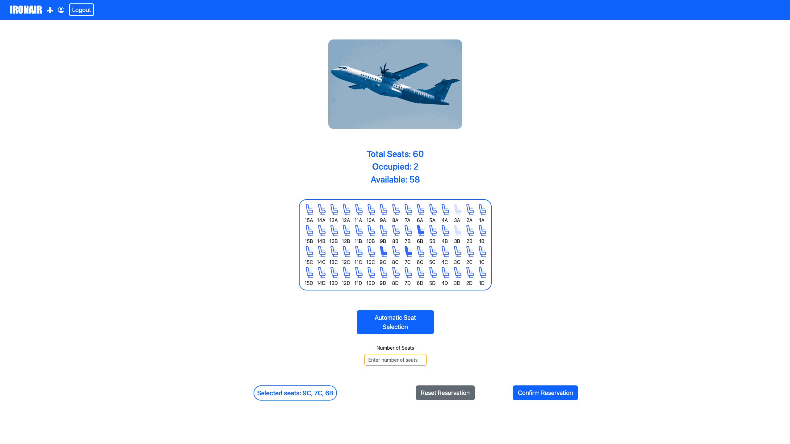
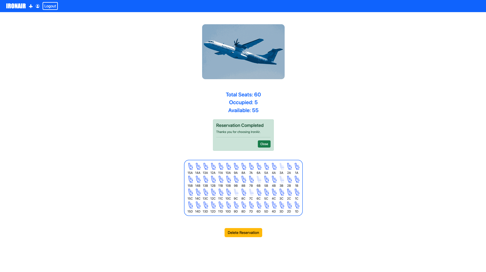

The following is the README.md file as required by the specifications for this project. The site is a very simple plane seat reservation application, which has been created with Vite, React and Express, using SQLite for data persistency.

# Exam #2: "Airplane Seats"

## Student: s301199 Marco D'Almo

# Server side

## API Server

- POST `/api/login`
  - The API call has no parameters. In the request body there are the user credentials in JSON.
  - In case of successful authentication the return status code is 201, and the response body has the user informations (id, name, surname...) in JSON format. Otherwise the return status code is 401, and the message says "Incorrect username or password".
- GET `/api/sessions/current`
  - The API call has no request parameters.
  - The response code is 200 (OK), and the response body is the user information in JSON format as before. In case of failure it returns 401 (Unauthorized).
- DELETE `/api/sessions/current`
  - he API call has no request parameters.
  - It logs out the user by deleting the current session. It returns 200 (OK) in any case.
- GET `/api/planes/`
  - The API call has no request parameters.
  - The response code is 200 (OK), and the response body is a list of JSON objects each containing all the information relative to each plane (id, name, brief description, number of rows, number of columns...).
- GET `/api/planes/:id`
  - The API call has the id parameter, which is used to determine which plane information give as response.
  - The response code is 200 (OK), and the response body is a JSON object with all the info of the corresponding plane. If the parameter is not an Integer or is higher or lower than fixed thresholds the response code is 422 (Unprocessable Entity).
- GET `/api/planes/:id/seats`
  - The API call has the id parameter, which is used to determine which plane information give as response. It differentiates from the previous for the addition of '/seats'.
  - The response code is 200 (OK), and the response body is a JSON object with all the occupied seats of the requestes plane. If the id is not an integer or is below a minimum it returns 422 (Unprocessable Entity).
- GET `/api/reservations/user/:uid`
  - The API call has the id parameter, which is used to determine which user we are interested in .
  - The response code is 200 (OK), and the response body is a JSON object with all the reservations made by a specific user. If the id is not an integer or is below a minimum it returns 422 (Unprocessable Entity).
- POST `/api/reservations/`
  - The API call has no parameter. The request body contains the plane_id, user_id and seats in string format needed to create a new reservation.
  - The server verifies that the user is logged in, and returns 401 (Unauthorized) otherwise. It also checks for validity of the plane_id. After substituting the user_id with the id of the currently authenticated user it creates the entry in the database. The response code is 201 (Created), and the response body is the ID of the reservation created. If some of the seats in the request body appear to be already reserved in the database it returns a JSON object with an error message and the list of the occupied seats codes.
- DELETE `/api/reservations/:rid`
  - The API call the 'rid' parameter, which indicates which reservations we want to delete.
  - The server verifies that the user is logged in, and returns 401 (Unauthorized) otherwise. It also checks for validity of the request parameter.The response code is 200 (Created) in case of successful deleting of the reservation, and 404 otherwise. The server proceeds to update the informations in all the tables of the DB concerning the deleted reservation.
## Database Tables

- Table `users` - Contains user information, password are crypted;
  - id VARCHAR(7) NOT NULL
  - name VARCHAR(25) NULL
  - surname VARCHAR(25) NULL
  - email VARCHAR(50) NULL
  - password VARCHAR(50) NULL
  - salt VARCHAR(25) NULL
  - PRIMARY KEY("id")

- Table `planes` - contains all informations about the planes, with also a brief description
  - id INTEGER NOT NULL
  - plane_name VARCHAR(25) NULL
  - type VARCHAR(25) NULL
  - description VARCHAR(100) NULL
  - seats INTEGER NULL
  - num_rows INTEGER NULL
  - num_columns INTEGER NULL
  - occupied_seats INTEGER NULL
  - PRIMARY KEY(id)
- Table `reservations` - contains the reservation informations.
  - id INTEGER PRIMARY KEY AUTOINCREMENT NOT NULL
  - user_id VARCHAR(7) NULL
  - plane_id INTEGER NULL
- Table `seats_reserved` - Contains the seats that are present in some reservation, with the corresponding reservation id and plane id.
  - id INTEGER NOT NULL
  - plane_id INTEGER NULL
  - row INTEGER NULL
  - column VARCHAR(1) NULL
  - reservation_id INTEGER NULL
  - PRIMARY KEY(id)

# Client side

## React Client Application Routes

- Route `/`: Home page, with all the plane cards and basic plane info. It doesn't have a high number of states and functions as it is mostly static. It hosts the plane Cards with the presentation of the planes, along with the button to access the plane page. When logged in, the button text says "Add/Edit reservation"; when logged out, it just says "See plane page" Already in the home page the user has a visual suggestion on its authentication status.
- Route `/planes/:planeId`: Specific plane page, with 2D seat visualization and possibility to add or delete a reservation. It's where most of the complex operations happen, including Adding or deleting a reservation and manually or automatically select seats.
- Route `/login`: Login page, where the user can input credentials to get identified and authorized.

## Main React Components

- `Navigation` (in `Navigation.jsx`): The Navigation component is the navigation bar present in all views of the application. It hosts the link to the login page and, once logged in, the button to log out the current user. It also hosts the main title of the page which serves as a link to the Home page. The icons in the navigation bar change based on the authentication status, to give a visual clue to the user about their status.
- `HomeLayout` (in `PageLayout.jsx`): The Home Layout component resides in the PageLayout.jsx file, and it builds the home page, which shows the PlaneCard components and some information about seat availability for each plane. It uses the props passed from the App.jsx file, which calls the backend to retrieve the plane information to show in the view.
- `PlaneCard` (in `PlaneCard.jsx`): The PlaneCard component is the reused component showing the plane image, name and description in the home page. It was created using React Bootstrap Card element, and it features a link to access the corresponding Plane Page.
- `Login` (in `Login.jsx`): Very simple Login page. It shows an error message when authentication fails due to incorrect credentials, and greets the user after a successful login.
- `PlaneLayout` (in `PageLayout.jsx`): the component that handles most of the application possible interactions. If logged out, the component renders the page with the 2D seat visualization and seat availability information, but the seats cannot be selected, and some text suggests to the user to log in if they wish to manage their reservation or create a new one for the specific plane. Once logged in, the seat visualization comes alive, and it is possible to manually select seats, or to click a button that selects the desired amount. The user can at any time reset their seat selection with the Reset Reservation button, and confirm their seat selection to create a new reservation. If the reservation is successfull, a prompt shows confirming the success of the operation and the seat visualization freezes again; only a Delete reservation button is visible. If the reservation fails because another user reserves that the current users had selected, the problematic seats show in the 2d visualization and a danger prompt suggests the user the reason why the reservation failed.
The component has various handlers for the confirmation, reset, or deletion of the reservation, and makes frequent API calls to update the 2D visualization of the seats as well as the seat availability general information.
- `SeatVisualization` (in `SeatVisualization.jsx`): The component renders a 2d seat visualization for the given plane, based on the number of rows and seats per row of the plane model. It updates based properties received in the Plane Layout page on the base of user actions.

# Usage info

## Example Screenshot

## Users Credentials

- Luigi Bosso
  - Username: lbosso@gmail.com, Password: ironairtest
  - Has a reservation on each plane.
- Giulia Olivieri
  - Username: giulia.olivieri@gmail.com, Password: ironairtest
  - Has a reservation on plane 0 and 1.
- Daniela Berardino: 
  - Username: daniela.berardino@gmail.com, Password: ironairtest
  - Has no reservations.
- Lorenzo Ritorto
  - Username: ritorto.lorenzo@gmail.com, Password: ironairtest
  - Has no reservations.

